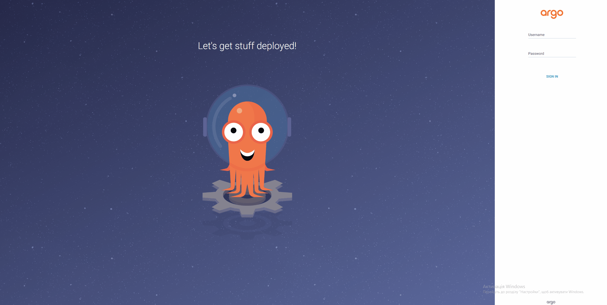

# ArgoCD Proof of Concept (PoC)

## 📌 Overview

This document describes the deployment of a local Kubernetes cluster and installation of ArgoCD for the AsciiArtify project.

The goal of this PoC is to:

* Deploy a Kubernetes cluster locally
* Install ArgoCD
* Provide access to the ArgoCD Web UI
* Validate readiness for MVP implementation

For this PoC, we use **k3d** as the Kubernetes distribution due to its lightweight nature and fast startup time.

---

## 🧰 Technologies Used

* Kubernetes (via k3d)
* Docker
* kubectl
* ArgoCD

---

## ⚙️ Prerequisites

Before starting, ensure the following tools are installed:

```bash
docker version
kubectl version --client
k3d version
```

If any command fails, install the required tool.

---

## 🚀 Step 1: Create Kubernetes Cluster

Create a local Kubernetes cluster using k3d:

```bash
k3d cluster create argocd-cluster
```

Verify cluster is running:

```bash
kubectl get nodes
```

Expected output:

```text
NAME                     STATUS   ROLES                  AGE
k3d-argocd-cluster...   Ready    control-plane,master   XXs
```

---

## 📦 Step 2: Install ArgoCD

### Create namespace:

```bash
kubectl create namespace argocd
```

### Apply ArgoCD manifests:

```bash
kubectl apply -n argocd \
-f https://raw.githubusercontent.com/argoproj/argo-cd/stable/manifests/install.yaml
```

---

## ⏳ Step 3: Wait for ArgoCD to Start

Check pods:

```bash
kubectl get pods -n argocd
```

Wait until all pods are:

```text
Running
```

If not ready, check logs:

```bash
kubectl logs -n argocd <pod-name>
```

---

## 🌐 Step 4: Access ArgoCD Web UI

Forward ArgoCD server port:

```bash
kubectl port-forward svc/argocd-server -n argocd 8080:443
```

Open in browser:

```
https://localhost:8080
```

⚠️ Accept the self-signed certificate warning.

---

## 🔑 Step 5: Retrieve Admin Password

Run:

```bash
kubectl -n argocd get secret argocd-initial-admin-secret \
-o jsonpath="{.data.password}" | base64 -d
```

Login credentials:

* Username: `admin`
* Password: (output from command above)

---

## ✅ Step 6: Verify ArgoCD

After login:

* ArgoCD dashboard should load
* Cluster should be visible
* No applications deployed yet (expected)

---

## 🎥 Demo

Below is a demonstration of the full setup process:

<p align="center">
  
</p>

---

## 🧪 Troubleshooting

### ❌ Docker not running

Error:

```
Cannot connect to Docker daemon
```

Solution:

* Start Docker Desktop

---

### ❌ k3d cluster fails

```bash
k3d cluster delete argocd-cluster
k3d cluster create argocd-cluster
```

---

### ❌ Port already in use

Change port:

```bash
kubectl port-forward svc/argocd-server -n argocd 9090:443
```

---

### ❌ Pods not starting

Check:

```bash
kubectl describe pod -n argocd <pod-name>
```

---

## 📊 Result

* Kubernetes cluster successfully deployed using k3d
* ArgoCD installed and running
* Web UI доступний через localhost
* System ready for GitOps workflow

---

## 🧠 Conclusion

ArgoCD provides a powerful GitOps-based deployment mechanism and integrates well with lightweight Kubernetes distributions like k3d.

This PoC confirms readiness of the AsciiArtify platform for:

* Continuous Delivery
* GitOps workflows
* Scalable Kubernetes deployments

Recommended next step:

* Connect Git repository and deploy first application via ArgoCD

---

