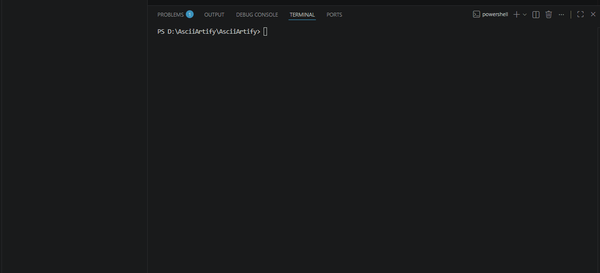

# AsciiArtify

> Kubernetes-based PoC for AI image → ASCII conversion platform

---

## 📌 Overview

AsciiArtify is a Proof of Concept project exploring Kubernetes local development tools for building a scalable ASCII-art generator powered by Machine Learning.

---

## ⚙️ Local Kubernetes Options

| Tool     | Type            | Speed | Best For |
|----------|----------------|-------|----------|
| Minikube | VM-based       | Medium | Learning |
| kind     | Docker-based   | Fast   | CI/CD    |
| k3d      | Lightweight k3s | Very Fast | PoC 🔥 |

---

## 🏆 Recommendation

👉 **k3d** is the best choice for PoC due to:
- fast startup
- low resource usage
- simple Docker-based workflow

---

## 🎥 Demo

<p align="center">
  
</p>

---

## 📄 Documentation

- 📘 [Concept Document](./doc/Concept.md)

---

## 🚀 Quick Start

```bash
k3d cluster create mycluster
kubectl apply -f demo/deployment.yaml
kubectl get pods
